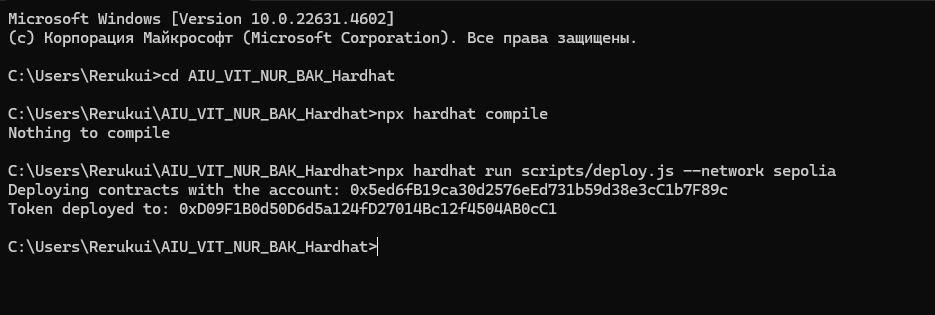
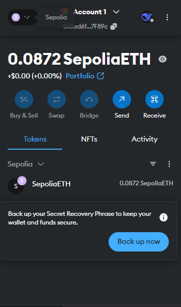
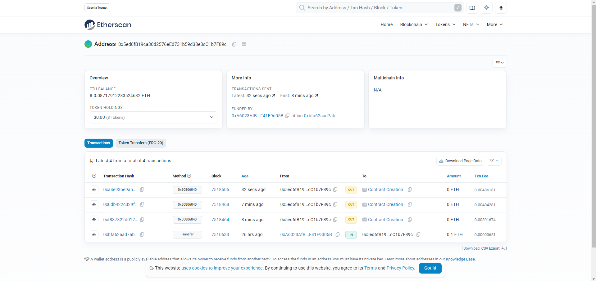
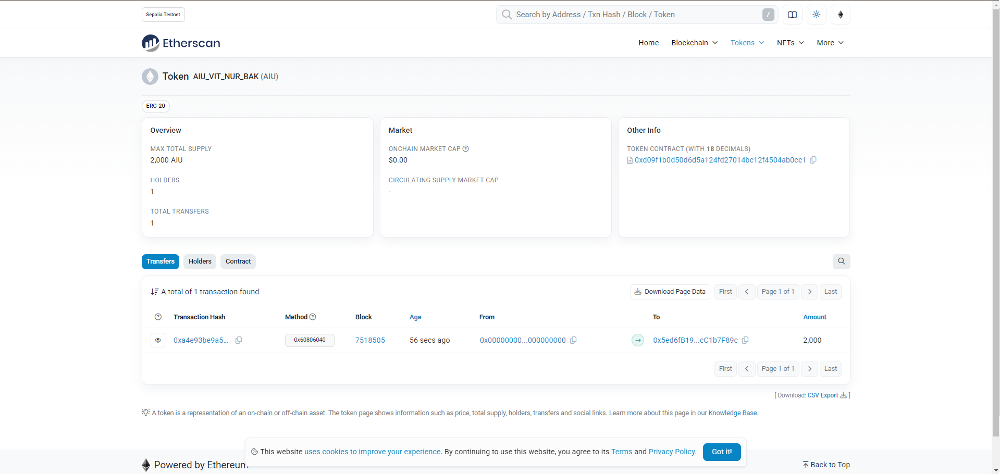

# AIU_VIT_NUR_BAK Token (ERC-20)

This repository contains the source code for the **AIU_VIT_NUR_BAK** token, an ERC-20 token deployed on the Sepolia testnet. The token has an initial supply of 2000 tokens and includes additional functions to retrieve transaction information.

## Table of Contents
- [Features](#features)
- [Usage](#usage)
- [Examples](#examples)
- [Screenshots](#screenshots)
- [License](#license)

## Features

- **ERC-20 Standard**: The token follows the ERC-20 standard.
- **Initial Supply**: 2000 tokens are minted to the deployer's address upon deployment.
- **Transaction Information**:
  - Retrieve the block timestamp of the latest transaction in a human-readable format.
  - Retrieve the address of the transaction sender.
  - Retrieve the address of the transaction receiver.

## Usage

### Prerequisites

- Node.js (v16 or higher)
- Hardhat
- MetaMask (for interacting with the contract)
- Sepolia testnet ETH (for gas fees)

### Installation

1. Clone the repository:
   ```bash
   git clone https://github.com/your-username/AIU_VIT_NUR_BAK.git
   cd AIU_VIT_NUR_BAK

2. Install dependencies:
    ```bash
    npm install

3. Set up environment variables:
    Create a .env file in the root directory and add the following:
    ```bash
    QUICKNODE_URL="your_quicknode_url"
    PRIVATE_KEY="your_private_key"

4. Compile the Contract
    ```bash
    npx hardhat compile

5. Deploy the Contract
    Deploy the contract to the Sepolia testnet:
    ```bash
    npx hardhat run scripts/deploy.js --network sepolia

### Interact with the Contract

1. Open Hardhat Console:
    ```bash
    npx hardhat console --network sepolia

2. Attach to the deployed contract:
    ```bash
    const contractAddress = "0xYourContractAddress";
    const AIU_VIT_NUR_BAK = await ethers.getContractFactory("AIU_VIT_NUR_BAK");
    const token = await AIU_VIT_NUR_BAK.attach(contractAddress);

3. Example interactions:

    Get the latest transaction timestamp:
    ```bash
    const timestamp = await token.getLatestTransactionTimestamp();
    console.log("Latest Transaction Timestamp:", timestamp);

    Get the transaction sender:
    ```bash
    const sender = await token.getTransactionSender();
    console.log("Transaction Sender:", sender);

    Get the transaction receiver:
    ```bash
    const receiverAddress = "0xReceiverAddress";
    const receiver = await token.getTransactionReceiver(receiverAddress);
    console.log("Transaction Receiver:", receiver);

### Examples

1. Deploying the Contract
    ```bash
    npx hardhat run scripts/deploy.js --network sepolia

2. Checking Token Balance
    ```bash
    const balance = await token.balanceOf("0xYourWalletAddress");
    console.log("Token Balance:", balance.toString());

## Screenshots
- 
- 
- 
- 

